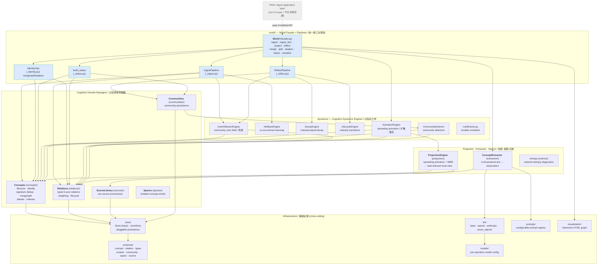
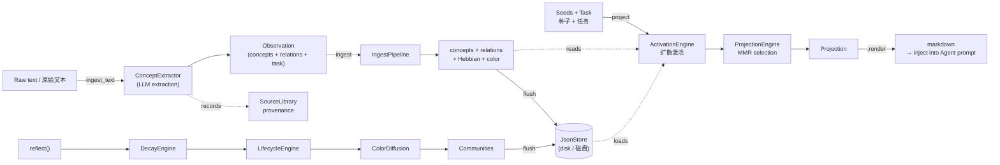
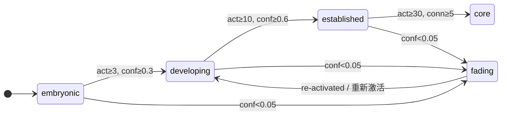

# World 0 — Architecture / 架构图

> Scope: the **World 0 core cognitive system** (the `World` facade and everything beneath it).
> The PKM / Agent application layer (PKMAgent, CLI/Web/GUI, MCP, tools, research, external, sessions) is **out of scope** for this diagram — it lives in the separate [`world0-pkm`](../../world0-pkm) project (the `pkm` package), which depends on this core.
>
> 范围：**World 0 核心认知系统**（`World` 统一接口及其下层）。PKM / Agent 应用层位于独立项目 [`world0-pkm`](../../world0-pkm)（`pkm` 包），不在本图范围内。

## 1. Component Architecture / 组件架构

## 2. Operational Data Flow / 操作数据流

The system is an **operational chain**, not a CRUD store. / 系统是一条操作链，而非 CRUD 存储。

### Concept Lifecycle / 概念生命周期

